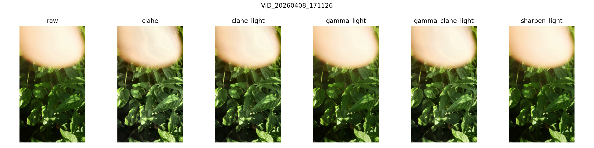
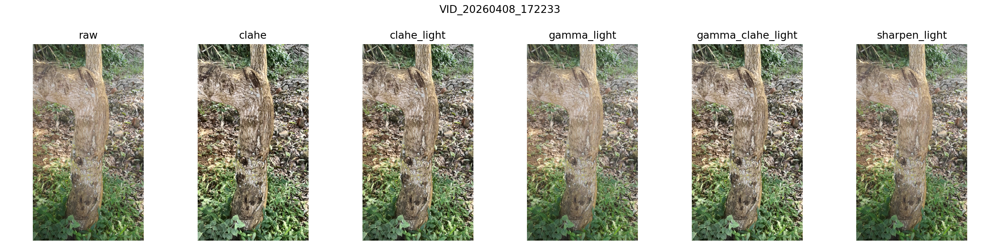

# Presentation Outline

## Slide 1: Title

**Enhancing Smartphone-Captured Herbal Plant Video Frames**

- Computer Vision Mini Project
- Victor
- Task: image enhancement + weakly supervised recognition

## Slide 2: Project Summary

- Dataset: 21 short smartphone videos of herbal plants
- Problem: outdoor videos are noisy, cluttered, and inconsistently lit
- Constraint: no expert plant species labels
- Approach: enhance frames, then test recognition performance
- Best result: CLAHE and `gamma_light` improved ResNet18-logistic regression accuracy from 91.49% to 92.20%

## Slide 3: Dataset

- Source: MUELE project dataset
- 21 short videos
- Herbal plant imagery
- Captured using a smartphone camera
- Diverse lighting conditions and environments
- No species labels
- No bounding-box annotations

## Slide 4: Visual Challenge: Stems, Leaves, and Clutter

- Plant subjects are mixed with stems, soil, bark, and surrounding vegetation
- Leaves overlap each other
- The main plant is not always visually isolated
- Detection would be difficult without manual annotations
- Recognition must rely on subtle texture, color, and shape cues

## Slide 5: Visual Challenge: Bad Lighting

- Some frames contain harsh sunlight
- Some areas are overexposed or clipped
- Other areas are in shadow
- One frame can contain both bright and dark regions
- This motivates local contrast and tone enhancement

## Slide 6: Visual Challenge: Blur and Smartphone Capture

- Videos are handheld
- Some frames are blurred by motion or focus issues
- Compression can reduce fine texture
- Framing changes across videos
- Not every sampled frame is equally useful

## Slide 7: Project Goal

- Main goal: test whether image enhancement improves plant-frame recognition
- Not just making images look nicer
- Enhancement is treated as a measurable preprocessing step
- Compare recognition on raw frames versus enhanced frames
- Keep the task honest because labels are weak

## Slide 8: No Labels Problem

- Dataset description does not provide species names
- No expert class labels are available
- Assumption: each video mostly captures one distinct plant subject
- Frames inherit the source video ID as a weak label
- This is video-level recognition, not botanical species classification

## Slide 9: Frame Sampling

- Extract frames from every raw video
- Sample approximately one frame per second
- Cap extraction at 30 frames per video
- Shorter clips produce fewer than 30 frames
- Final extracted dataset: 469 frames from 21 videos
- Frame index saved as CSV with video ID, timestamp, frame index, and path

## Slide 10: Enhancement Techniques

- `raw`: no enhancement
- `clahe`: local contrast enhancement
- `clahe_light`: gentler CLAHE
- `gamma_light`: mild tonal correction
- `gamma_clahe_light`: gamma + light CLAHE
- `sharpen_light`: mild sharpening
- Design choice: conservative enhancement, not heavy overprocessing

## Slide 11: Why These Techniques?

- CLAHE improves local contrast under uneven lighting
- Gamma correction adjusts midtones without changing all pixels uniformly
- Sharpening tests whether clearer edges help recognition
- All are simple, fast, explainable, and reproducible
- Stronger methods exist, such as Retinex and deep low-light enhancement
- Classical methods fit this small weakly labeled dataset better

## Slide 12: Feature Extraction

- Handcrafted features:
- HSV color histograms
- Edge density
- Laplacian sharpness variance
- Tiny CNN:
- Learns features directly from 96x96 crops
- ResNet18 embeddings:
- Uses pretrained visual features from a stronger CNN

## Slide 13: Models and Baselines

- Logistic regression on handcrafted features
- 3-nearest neighbors on handcrafted features
- Tiny CNN trained from scratch
- Logistic regression on ResNet18 embeddings
- 3-nearest neighbors on ResNet18 embeddings
- Same stratified 70/30 frame-level split for raw and enhanced variants

## Slide 14: Why ResNet18 + Logistic Regression?

- ResNet18 is used as a fixed feature extractor
- Final ResNet classification layer is removed
- Each frame becomes a feature embedding
- Logistic regression learns the weak video-level classes
- Useful when the dataset is too small to train a large CNN from scratch
- Strongest setup in the experiments

## Slide 15: Results

Top ResNet18-logistic regression results:

| Variant | Accuracy |
|---|---:|
| `clahe` | 0.921986 |
| `gamma_light` | 0.921986 |
| `raw` | 0.914894 |
| `sharpen_light` | 0.914894 |
| `clahe_light` | 0.907801 |
| `gamma_clahe_light` | 0.907801 |

Key result:

- CLAHE and `gamma_light` slightly outperform raw frames

## Slide 16: Visual Comparison

- Before-and-after grids support qualitative inspection
- CLAHE can reveal local leaf and stem contrast
- Gamma correction gives a gentler tonal adjustment
- Some enhancement improves visibility
- Too much enhancement can change useful recognition cues

## Slide 17: Analysis

- Mild enhancement helps more than aggressive enhancement
- `clahe` and `gamma_light` beat the raw ResNet18 baseline
- `sharpen_light` only matches raw performance
- `clahe_light` and `gamma_clahe_light` fall below raw
- Pretrained ResNet18 embeddings outperform the Tiny CNN
- Small weakly labeled data is not ideal for training CNNs from scratch

## Slide 18: Limitations

- Labels are weak video-level labels
- Results do not prove species classification
- Current split is frame-level, not full video-level holdout
- Similar frames may appear in train and test sets
- Severe overexposure cannot recover lost image detail
- Dataset is small

## Slide 19: Future Work and Conclusion

Future work:

- Add expert species labels if available
- Use video-level or segment-level holdout splits
- Add no-reference image quality metrics
- Compare Retinex or deep low-light enhancement
- Test additional pretrained CNNs

Conclusion:

- A practical enhancement pipeline was built from unlabeled plant videos
- Mild enhancement can improve weak plant recognition
- Best result: 91.49% raw to 92.20% with CLAHE or `gamma_light`
- The project stays reproducible and honest about the dataset limits
